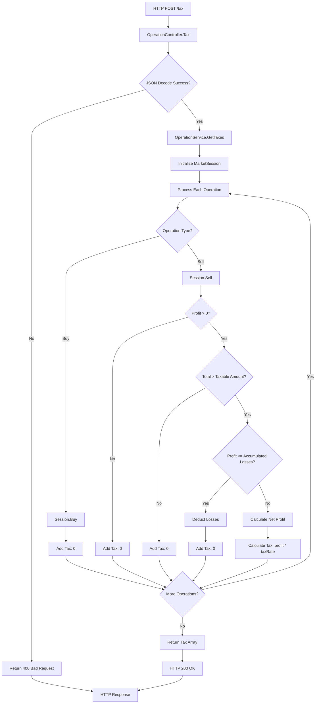

# Tax

# Compile and Run
```console
  # Run
  make run

  # Compile
  make build

  # Test
  make test

  #Benchmark
  make bench
```

# Insights

## Architecture

This project implements **Hexagonal Architecture**,
which provides a clean separation of concerns, aggresively decouples the application
and makes it more testable and maintainable without excesive amounts of boilerplate code.

### Overview

Three main layers:

1. **Domain Layer** (`internal/domain/`) - Business logic
2. **Ports Layer** (`internal/ports/`) - Contracts
3. **Adapters Layer** (`internal/adapters/`) - External implementations (infrastructure, domain agnostic implementations, etc)

#### Domain
- **Entities** (`internal/domain/entities/`)
  - `Operation`: Buy/Sell operations
  - `Tax`: Calculated tax amounts
  - `MarketSession`: Handles trading state, incuding `AccumulatedWeightedUnitCost` to speed up calculations leveraging basic math haha 
- **Services** (`internal/domain/services/`): Business logic implementation
  - `OperationService`: Core tax calculation logic

#### Ports
- **Input Ports** (`internal/ports/iport/`): Ports receiving external data
  - `OperationService`: Contract for tax calculation operations

#### Adapters
- **API Adapters** (`internal/adapters/api/`): HTTP layer implementation
  - **Controllers** (`internal/adapters/api/controller/`): HTTP requests/responses
  - **Server** (`internal/adapters/api/server/`): HTTP server configuration and routing

### File Tree Overview

```
tax/
├── cmd/                          # Entry points (just one executable atm)
│   ├── main.go                   # Executable
│   ├── main_integration_test.go  # Integration tests
│   └── main_benchmark_test.go    # Benchmark tests
├── internal/                     # Bussiness dependant code
│   ├── domain/                   # Domain layer
│   │   ├── entities/             # Entities
│   │   │   ├── operation.go      # Operation
│   │   │   ├── tax.go            # Tax
│   │   │   └── session.go        # Market session
│   │   └── services/             # Business services
│   │       └── operation_service.go  # Tax calculation
│   ├── ports/                   # Ports
│   │   └── iport/                # Input ports
│   │       └── operation_service.go  # Operation service interface
│   └── adapters/               # Adapters
│       └── api/                # API adapters
│           ├── controller/      # REST HTTP controllers
│           │   ├── controller.go           # Base controller interface
│           │   ├── health_controller.go    # Health check endpoint
│           │   └── operation_controller.go # Tax calculation endpoint
│           └── server/         # HTTP server
│               └── server.go   # Server configuration and routing
├── go.mod                      # Dependencies
├── makefile                    # Commands
└── README.md                   # Documentation
```

### Architecture Benefits

1. **Separation of Concerns**: Business logic isolated from HTTP concerns
2. **Testability**: Each layer can be tested independently
3. **Flexibility**: Easy to swap implementations
4. **Maintainability**: Clear boundaries make code easier to understand and modify

## Design

### Tax Calculation Flow

The `/tax` endpoint implements the required tax calculation system featuring this flow:



### Key Design Decisions

1. **Weighted Average Cost Method**: Uses weighted average for calculating profit/loss on sales
2. **Losses**: Accumulated losses are deducted from future profits
3. **Tax Threshold**: Only operations above a certain amount are taxable
4. **Stateful Session**: Maintains state across the same operation batch to save on calculation costs

### Business Rules

- **Buy Operations**: Always result in 0 tax
- **Sell Operations**: Tax calculation based on:
  - Profit calculation using weighted average cost
  - Loss carryforward from previous operations
  - Taxable amount threshold of 20,000 (configurable)
  - Tax rate of 20% (configurable)
- **Session Management**: Maintains running totals for:
  - Accumulated weighted unit cost
  - Number of shares bought
  - Accumulated losses for tax deduction

### Error Handling

- **Invalid JSON**: Returns 400 Bad Request
- **Insufficient Shares**: Returns error when trying to sell more than bought
- **Service Errors**: Returns 500 Internal Server Error (for example the above error is converted to 500)

## Iterations

<details>
 <summary>First iteration</summary>

  ### Server

  Simple server implementation with health controller and tax controller, no business logic yet
</details>

<details>
 <summary>Second iteration</summary>

  ### MVP

  Operation service with dumb business logic approach and simple integration test simulating a request
</details>

<details>
 <summary>Third iteration</summary>

  ### Descriptive Refactor

  Refactored operation_service, entities and tests with a focus based on cleanlyness and expresiveness of the code.
</details>

<details>
 <summary>Fourth iteration</summary>

  ### Correctness

  Added various tests including an integration test covering all edge cases, achieved full correctness of the implementation.
</details>

<details>
 <summary>Fifth iteration</summary>

  ### Optimization

  Made little optimizations based on benchmark tests outputs
</details>

## Final thoughts

Was a very entertaining challenge overall, I think I achieved an acceptable balance between maintainability and simplicity for the challenge sake.
If you reached this far down thank you for taking the time to read, hope you have a nice week! And please leave your feedback so I can keep improving!

<sub>This was a Conekta backend technical challenge<sub>
